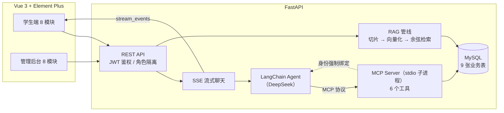

# 校园课程智能助手（course-agent）

基于 **AI Agent + MCP + RAG** 的全栈校园课程助手：学生通过自然语言与 Agent 对话，即可查询课表、检索个人课程资料、管理作业/成绩/学习计划；教师通过管理后台维护全部数据。前后端分离，工具层基于 MCP 协议与 Agent 解耦。

## 架构



**核心设计**：

- **MCP 工具层与 Agent 解耦**：业务能力封装为独立 MCP Server（stdio 子进程），Agent 通过协议调用，工具可独立复用
- **多租户身份强制绑定**：`UserBoundTool` 包装层无论模型传入什么 `user_id`，执行前一律覆盖为当前登录用户，从协议层面杜绝越权（水平越权返回 404）
- **RAG 个人知识库**：学生上传资料自动切片/向量化入库，检索按 `user_id` 过滤，Agent 回答附带溯源（文件名/切片/相似度）
- **多轮记忆**：会话历史最近 20 条拼入 Agent 输入，支持「这门课的老师是谁」类代词追问
- **日期感知**：系统提示注入当前日期与教学周，Agent 可换算「今天/明天/下周一」并判断周次范围内是否上课
- **观测性**：每条回答落库首字耗时/总耗时/工具调用痕迹/检索溯源，学生端仪表盘与后台统计可视化

## 功能

### 学生端（8 模块）
| 模块 | 说明 |
|---|---|
| 课程助手 | SSE 流式对话、工具调用过程卡片、Markdown 表格渲染、会话历史管理 |
| 学习数据 | 消息数/工具调用分布/平均耗时/GPA/待办作业等统计与提醒 |
| 我的课表 | 周次课表 + 本周日期列 |
| 作业/DDL | 待办作业、逾期标红、完成打卡（Agent 可查询并帮你规划） |
| 课程资料 | 上传 pdf/docx/txt/md，自动入库为个人知识库 |
| 复习卡片 | 基于 RAG 检索个人资料，LLM 生成问答卡，翻卡复习 |
| 学习计划 | Agent 生成学习计划，支持查看/编辑/完成标记 |
| 成绩绩点 | 4.0 标准绩点换算、加权 GPA、最弱科目分析 |

### 管理后台（8 模块）
系统统计（10 项指标）、文档管理（预览/重新入库/删除）、课程管理、课表管理（节次冲突检测）、作业管理、成绩管理、用户管理（角色/重置密码/级联保护）。

### MCP 工具（6 个）
`get_my_schedule` · `search_course_documents` · `list_my_documents` · `save_study_plan` · `get_upcoming_assignments` · `get_my_scores`

## 快速开始

环境要求：Python 3.11+、Node 18+、MySQL 8、DeepSeek API Key

```bash
# 1. 数据库
mysql -uroot -p -e "CREATE DATABASE course_agent CHARACTER SET utf8mb4;"

# 2. 后端
cd backend
python -m venv .venv && .venv\Scripts\activate     # Windows
pip install -r requirements.txt
# 配置 backend/.env：
#   DATABASE_URL=mysql+pymysql://root:密码@127.0.0.1:3306/course_agent?charset=utf8mb4
#   DEEPSEEK_API_KEY=sk-xxx
#   SEMESTER_START=2026-09-07          # 开学日期（用于推算教学周）
python -m app.seed                   # 建表 + 演示数据
python -m uvicorn app.main:app --port 8000

# 3. 前端
cd frontend
npm install
npm run dev                          # http://localhost:5173
```

测试账号：`student01/student01`（学生）、`admin01/admin01`（管理员）

## 技术栈

Vue 3 · Element Plus · vue-router · FastAPI · SQLAlchemy 2.0 · MySQL 8 · LangChain · MCP（FastMCP） · DeepSeek API · SSE · JWT
